# 📊 SYSTEM ANALYSIS DOCUMENT — v4.0
## World Cup 2026 Tactical Predictor — AI-Powered "God Mode" Prediction Engine

> **Versi:** 4.0.0
> **Tanggal:** 10 Juni 2026
> **Author:** System Analyst Team (SA + BA + ARCH)
> **Status:** ✅ Approved for Development
> **Basis revisi:** Council Review v2 (COUNCIL-REVIEW-v2_SA-Update-Decision.md)
> **Menggantikan:** SYSTEM-ANALYSIS v3.0

---

## 📋 CHANGELOG v4.0 — APA YANG BERUBAH DARI v3.0

| Ref | Perubahan | Alasan |
|-----|-----------|--------|
| SA-FINDING-01 | Integration Map digambar ulang total | BALLDONTLIE bukan free tier untuk lineup/events |
| SA-FINDING-02 | Sumber data pelatih didefinisikan eksplisit | Data pelatih salah (Dorival vs Ancelotti) |
| SA-FINDING-03 | Canonical format `group` field = "Group X" | Field inkonsisten "A" vs "Group A" |
| SA-FINDING-04 | FR-04 statistik tim: sumber diperjelas | attackRating tidak ada di API gratis |
| SA-FINDING-05 | FR-05 profil pemain: ditandai PHASE-2 | 1.248 entri — tidak realistis manual |
| SA-FINDING-06 | FR-17 win probability: diganti AI Re-Analysis | Model probability tidak terspesifikasi |
| SA-FINDING-07 | Fixture list: spesifikasi grouping per Grup A-L | Ambiguitas menyebabkan tampilan kosong |
| **PRD-NEW-01** | **Modul Taktis mendalam: Formasi + Pergerakan** | Visi "God Mode" baru dari owner |
| **PRD-NEW-02** | **Lineup Builder: ganti-ganti pemain interaktif** | User menyusun formasi → AI hitung impact |
| **PRD-NEW-03** | **FIFA Ranking sebagai data input AI** | Dasar prediksi objektif |
| **PRD-NEW-04** | **Tactical Movement Engine (head-to-head formasi)** | Formasi A vs B → siapa diuntungkan |
| **PRD-NEW-05** | **Prediction Score Engine berbasis multi-faktor** | Skor muncul dari aplikasi, AI mempertegas |
| BA-FINDING-02 | KPI direvisi untuk konteks personal project | KPI enterprise tidak relevan |
| ARCH-FINDING-03 | APIF_KEY ditambahkan ke env vars wajib | API-Football tidak disebutkan di v3.0 |
| ARCH-FINDING-04 | Confidence tier bobot direvisi | Asumsi data yang tidak tersedia |
| **BUG-FIX-01** | **Hook useFixtures: fixed double-wrap response** | Root cause jadwal kosong |
| **BUG-FIX-02** | **prediction-engine.ts: hapus dead-code duplicate return di `FIFA_RANKING_AVAILABLE`** | Council review 11 Juni 2026 |
| **FR-29 (BARU)** | **Second opinion API-Football `/predictions`** ditambahkan ke tab AI & Prediksi | Quick win dari addendum Strategic Analysis (free, 100 req/hari) |
| **STATUS-UPDATE** | FR-25/26/28 ditandai ✅ Done (sebelumnya 🔧 Dibangun) — implementasi sudah selesai | Council review 11 Juni 2026 menemukan kode lebih maju dari roadmap |

---

## 🎯 EXECUTIVE SUMMARY

**WC 2026 Tactical Predictor v4** adalah aplikasi web prediksi skor yang memberikan pengalaman "God Mode" kepada user — kemampuan melihat pertandingan dari sudut pandang yang mendekati kenyataan sebelum bola ditendang. Sistem mengintegrasikan **empat lapisan analisis**: ranking FIFA objektif, profil pelatih mendalam (formasi + prestasi + filosofi), lineup pemain aktual dengan kondisi terkini, dan **Tactical Movement Engine** yang mensimulasikan keunggulan taktis berdasarkan matchup formasi. Dari keempat lapisan ini, **Prediction Score Engine** menghitung skor prediksi secara deterministik, kemudian AI (Claude/Gemini) bertugas mempertegas dengan narasi taktis yang kaya. User juga dapat memodifikasi lineup secara interaktif — mengganti posisi pemain, mengubah formasi — dan melihat bagaimana perubahan itu mempengaruhi probabilitas hasil. Revisi v4.0 didasarkan pada Council Review v2 yang mengidentifikasi 7 cacat struktural di v3.0 dan PRD baru yang mengartikulasikan visi yang jauh lebih dalam dari sekadar "tebak skor".

---

## 📌 ASUMSI & SCOPE (v4.0)

### Asumsi yang Diverifikasi (bukan asumsi yang salah seperti v3.0)

| Asumsi | Status Verifikasi |
|--------|------------------|
| Next.js 14 App Router + Route Handler sebagai proxy | ✅ Sudah implemented |
| Data fixture 104 match dari openfootball | ✅ Terverifikasi live, 6 per grup |
| worldcup26.ir menyediakan live scores (JWT gratis) | ✅ Endpoint real, JWT dari registrasi gratis |
| API-Football menyediakan lineup + events (100 req/hari) | ✅ Terverifikasi — butuh `APIF_KEY` |
| BALLDONTLIE menyediakan lineup/events GRATIS | ❌ SALAH — hanya Teams+Stadiums gratis |
| Data pelatih 48 tim tersedia manual dari sumber publik | ✅ Diisi dari FIFPlay + Bolavip (Juni 2026) |
| Statistik performa tim (attack/defense/possession) dari API gratis | ❌ TIDAK ADA — perlu sumber alternatif |
| FIFA Ranking tersedia publik | ✅ Via API-Football `/standings` atau embedded |
| Supabase free tier cukup untuk leaderboard | ✅ 500MB DB, cukup |

### Data Availability Matrix (Baru — ARCH-FINDING-02)

| Data | Tersedia | Sumber | Tier/Biaya | Limit |
|------|:--------:|--------|:----------:|-------|
| Fixture 104 match (jadwal, venue, jam) | ✅ | openfootball | Gratis | Tidak ada |
| Live scores + status match | ✅ | worldcup26.ir | Gratis + JWT | Tidak ada |
| Standings grup | ✅ | worldcup26.ir / API-Football | Gratis | 100 req/hari |
| Lineup Starting XI | ✅ | API-Football | Gratis | 100 req/hari |
| Match events (gol, kartu) | ✅ | worldcup26.ir / API-Football | Gratis | 100 req/hari |
| Profil pelatih 48 tim | ✅ | Manual embed (coaches-manual.ts) | Gratis | Static |
| FIFA World Ranking | ✅ | Embedded + API-Football | Gratis | Static |
| Statistik performa tim (xG, shots, possession avg) | ⚠️ | API-Football (historis) | Gratis | 100 req/hari |
| Head-to-head historis | ⚠️ | API-Football | Gratis | 100 req/hari |
| Roster pemain lengkap 48 tim | ⚠️ | API-Football | Gratis | 100 req/hari |
| Player stats individual (rating, kondisi) | ❌ | BALLDONTLIE GOAT / Transfermarkt | $39.99/bln | — |
| xG real-time per pertandingan | ❌ | TheStatsAPI / Sportmonks | Berbayar | — |
| Betting odds (untuk probability) | ❌ | TheStatsAPI / Odds API | Berbayar | — |

### In-Scope v4.0

**CORE (Dikerjakan, gratis):**
- Jadwal 104 match dengan navigasi per Grup A-L + Knockout
- Live scores + status real-time via worldcup26.ir
- Standings 12 grup (dihitung dari hasil match)
- Profil pelatih 48 tim: formasi, filosofi, press style, win rate, prestasi
- **BARU: Tactical Movement Engine** — visualisasi keunggulan formasi A vs B
- **BARU: Lineup Builder** — user menyusun lineup interaktif, AI hitung impact
- **BARU: Prediction Score Engine** — skor deterministik dari multi-faktor
- **BARU: FIFA Ranking integration** — sebagai bobot dalam kalkulasi prediksi
- Formation Pitch SVG + mobile list view
- Confidence Tier System (4 tier, dikalkulasi sistem)
- AI Analysis fallback chain: Claude → Gemini → Static
- Tebak skor dengan sistem poin (+5/+3/+1 + bonus)
- Evaluasi poin setelah match selesai
- Leaderboard global (Supabase) + export JSON
- Onboarding wizard 3-langkah

**PHASE-2 (Butuh API berbayar atau data besar):**
- Profil pemain individual lengkap (roster + stats)
- xG real-time per pertandingan
- Win probability update otomatis
- Betting odds integration
- Full match statistics per pertandingan

**OUT-OF-SCOPE:**
- Backend custom / database server
- Sistem autentikasi (OAuth, SSO)
- Payment / monetisasi
- Push notification native
- Admin panel
- Multi-language

### Stakeholder

| Stakeholder | Role | Interest |
|-------------|------|----------|
| Owner/Developer | Builder + User | Pengalaman "God Mode" — prediksi mendekati kenyataan |
| Penggemar Sepak Bola | End User Casual | Tebak skor mudah + penjelasan AI |
| Analis & Pundit | End User Power | Taktis mendalam, formasi, pelatih |
| AI Providers (Anthropic/Google) | Infrastruktur | API AI |
| worldcup26.ir | Data Provider | Live scores |
| API-Football | Data Provider | Lineup, events, standings |
| Supabase | BaaS | Leaderboard global |

---

## 🗺️ MINDMAP APLIKASI (v4.0)

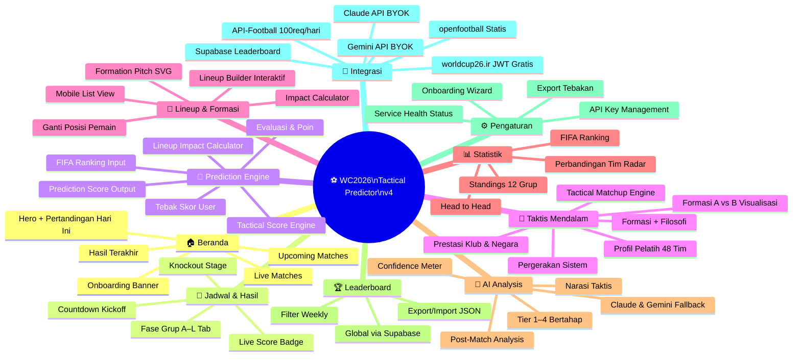

---

## 🔄 GENERAL FLOW PROCESS (v4.0)

### Flow Utama — Prediction God Mode

```mermaid
flowchart TD
    A([🟢 User Buka App]) --> B{First Visit?}
    B -->|Ya| OB[Tampilkan Onboarding Banner\n'Setup 3 langkah untuk God Mode']
    B -->|Tidak| C
    OB --> C[Load Homepage\nFixture Hari Ini + Live Matches]

    C --> D[Pilih Pertandingan]
    D --> E[Load Match Detail — 4 Tab]
    E --> F[Fetch Paralel via Route Handlers]

    F --> F1[/api/proxy/fixtures\nworldcup26.ir JWT]
    F --> F2[/api/proxy/lineups\nAPI-Football 100req/hari]
    F --> F3[/api/proxy/coaches\nManual embed 48 tim]
    F --> F4[/api/proxy/stats\nFIFA Ranking embedded]

    F1 & F2 & F3 & F4 --> G[calculateSystemConfidence\nTier 1-4 + Score 0-100]
    G --> H[Tab: Overview]
    G --> I[Tab: Lineup Builder]
    G --> J[Tab: Taktis Mendalam]
    G --> K[Tab: AI & Prediksi]

    H --> H1[Scoreboard + Countdown\nConfidence Meter\nStats Comparison Radar]

    I --> I1{Lineup tersedia?}
    I1 -->|Ya| I2[Tampilkan Formation Pitch SVG\n11 pemain interaktif]
    I1 -->|Tidak| I3[Placeholder + 'Tersedia H-1 jam']
    I2 --> I4[User bisa ganti posisi/pemain\nFormation Builder]
    I4 --> I5[calculateLineupImpact\nDelta prediksi skor]

    J --> J1[Coach Profile × 2\nFormasi + Prestasi + Filosofi]
    J1 --> J2[Tactical Matchup Engine\nFormasi A vs B → Winner]
    J2 --> J3[Visualisasi Pergerakan Sistem\nBlok Press, Ruang, Transisi]

    K --> K1[Prediction Score Engine\nDeterministik dari:\n- FIFA Ranking\n- Coach Style Match\n- Lineup Strength\n- Historical H2H]
    K1 --> K2[User bisa tebak skor\natau terima prediksi sistem]
    K2 --> K3{Turnamen Status?}
    K3 -->|PRE_MATCH/UPCOMING| K4[Kunci tebakan sebelum kickoff]
    K3 -->|LIVE| K5[Lock + Commentary Feed\nPolling 30s]
    K3 -->|FINISHED| K6[Evaluasi poin\nPost-match AI analysis\nUpdate Supabase]

    K2 --> K7[Jalankan AI Analysis\nTier sesuai confidence]
    K7 --> K8{API Key ada?}
    K8 -->|Ya: Claude| K9[Claude API → JSON taktis]
    K8 -->|Ya: Gemini| K10[Gemini API → JSON taktis]
    K8 -->|Tidak| K11[Static Analysis\nRule-based prediction]
    K9 & K10 & K11 --> K12[Render 5 Seksi:\nMatchup · Pelatih · Pemain\nPrediksi · Eval Tebakan User]
```

### Flow — Tactical Movement Engine (Baru, PRD-NEW-04)

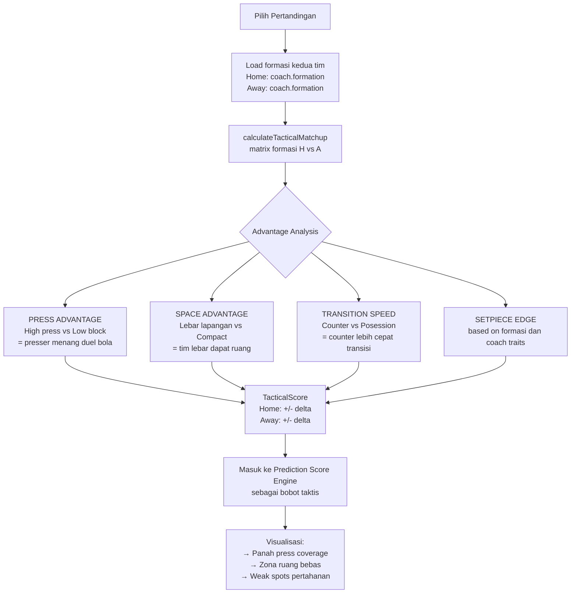

### Flow — Prediction Score Engine (Baru, PRD-NEW-05)

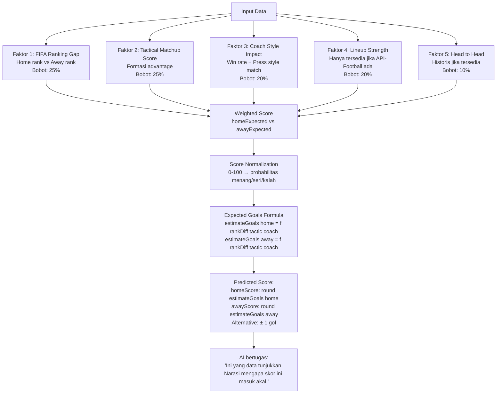

### Flow — Lineup Builder Interaktif (Baru, PRD-NEW-03)

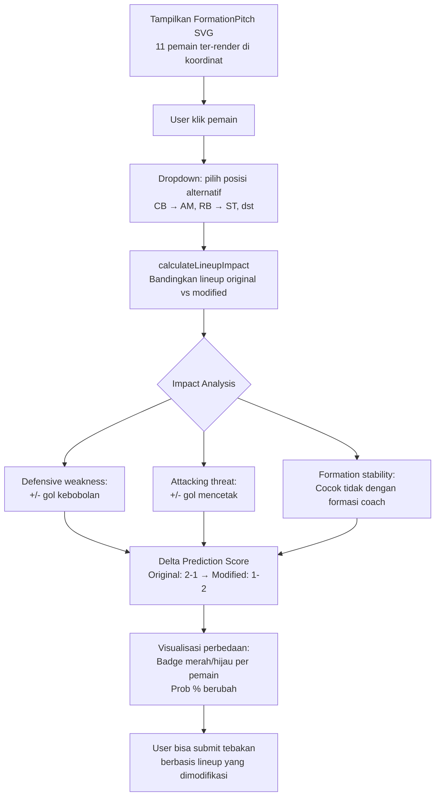

---

## 👥 USE CASE DIAGRAM (v4.0)

### Tabel Use Case

| ID | Use Case | Aktor | Deskripsi | Prioritas | Tier |
|----|----------|-------|-----------|:---------:|:----:|
| UC-01 | Lihat jadwal match per grup | User | Tampilkan 104 match dalam tab Grup A-L dan Knockout | High | CORE |
| UC-02 | Lihat skor live & hasil | User | Live score polling 30s dari worldcup26.ir | High | CORE |
| UC-03 | Lihat standings grup | User | 12 grup dihitung dari hasil actual | High | CORE |
| UC-04 | Lihat profil pelatih | User | 48 pelatih: formasi, win rate, prestasi, filosofi | High | CORE |
| UC-05 | Lihat tactical matchup | User | Analisis formasi A vs B — siapa diuntungkan | High | CORE |
| UC-06 | Build lineup interaktif | User | Ganti posisi pemain, lihat delta prediksi | High | CORE |
| UC-07 | Lihat prediksi skor sistem | User | Skor deterministik dari 5 faktor | High | CORE |
| UC-08 | Input tebakan skor | User | Input skor home-away, kunci sebelum kickoff | High | CORE |
| UC-09 | Jalankan AI analysis | User | Narasi taktis dari AI (Claude/Gemini/Static) | High | CORE |
| UC-10 | Setup API key | User | Onboarding wizard 3-langkah | High | CORE |
| UC-11 | Lihat evaluasi tebakan | User | Poin setelah match selesai + post-match AI | High | CORE |
| UC-12 | Lihat leaderboard | User | Global via Supabase, lokal fallback | Med | CORE |
| UC-13 | Export/import tebakan | User | Download JSON + upload kembali | Med | CORE |
| UC-14 | Cek service health | User/Dev | Status semua API provider di Settings | Med | CORE |
| UC-15 | Lihat formation pitch SVG | User | Visual lapangan 11 pemain + bench | Med | CORE |
| UC-16 | Lihat commentary live | User | Feed event gol/kartu/sub saat LIVE | Med | CORE |
| UC-17 | Lihat profil pemain lengkap | User | Roster tim + kondisi pemain | Low | PHASE-2 |
| UC-18 | Win probability real-time | User | Update prob saat skor berubah | Low | PHASE-2 |

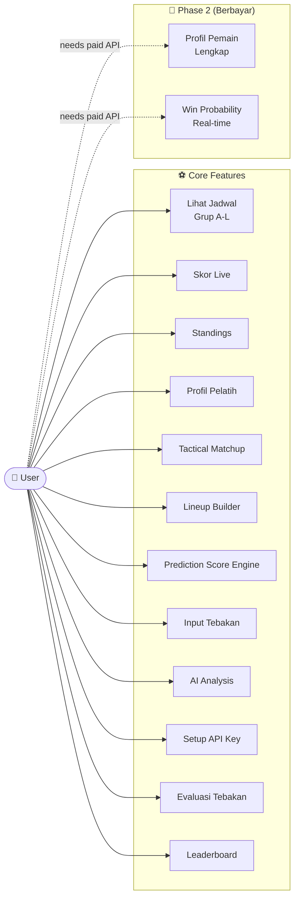

---

## 🔁 SEQUENCE DIAGRAM (v4.0)

### Sequence 1 — Proxy Layer & Fallback Chain (Diperbarui)

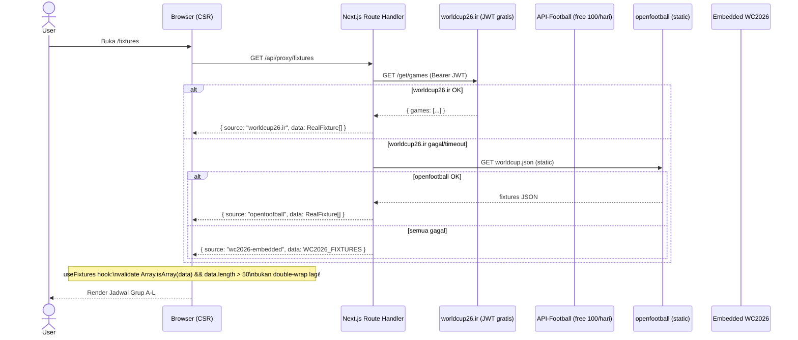

### Sequence 2 — Prediction Score Engine (Baru)

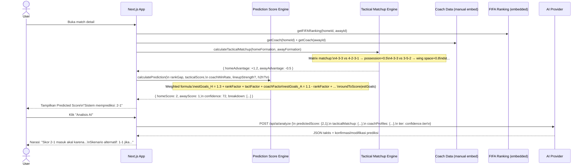

### Sequence 3 — Lineup Builder (Baru)

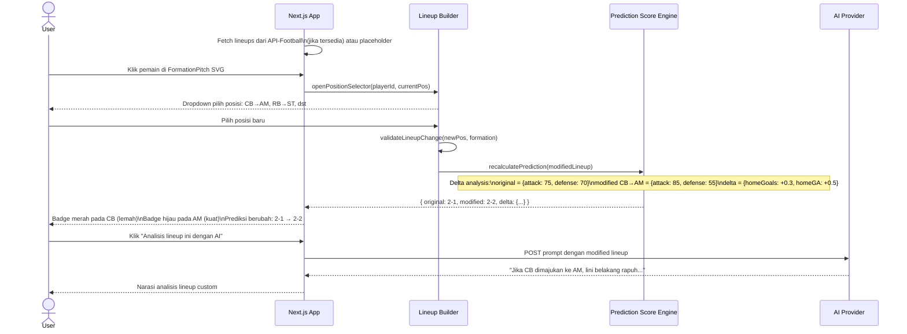

### Sequence 4 — AI Fallback Chain

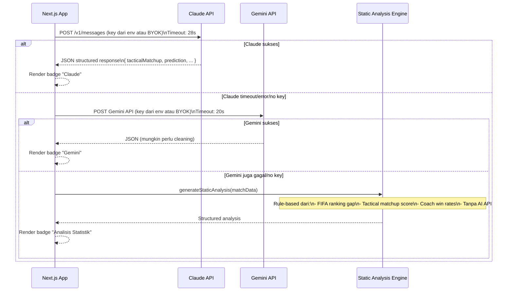

---

## 🗄️ DATA MODEL (v4.0)

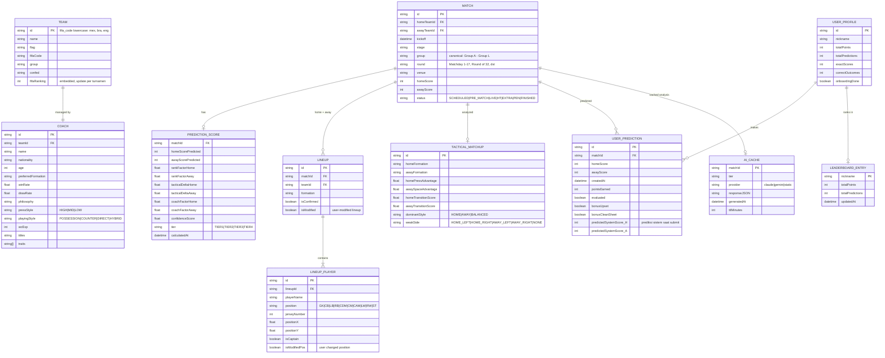

---

## 🏗️ ARSITEKTUR KOMPONEN (v4.0)

```mermaid
graph TB
    subgraph "📱 Pages — Next.js App Router"
        P1[/ Home\nLive + Upcoming + Recent]
        P2[/fixtures\nGrup A-L tabs + Knockout]
        P3[/match/id\n4 Tab Enhanced]
        P4[/coaches\n48 Pelatih Grid]
        P5[/standings\n12 Grup Computed]
        P6[/leaderboard\nSupabase + Lokal]
        P7[/settings\nAPI Keys + Health + Export]
    end

    subgraph "🔒 Route Handlers — Proxy"
        RH1[/api/proxy/fixtures\nworldcup26.ir → openfootball → embed]
        RH2[/api/proxy/lineups\nAPI-Football → embed]
        RH3[/api/proxy/coaches\nManual embed 48 tim]
        RH4[/api/proxy/events\nworldcup26.ir → API-Football → embed]
        RH5[/api/proxy/stats\nstandings + FIFA ranking]
        RH6[/api/proxy/health\nVerifikasi semua service]
        RH7[/api/ai/analyze\nClaude → Gemini → Static]
    end

    subgraph "⚽ Match Detail — 4 Tab"
        T1[Tab: Overview\nScoreboard + Countdown\nConfidence Meter\nStats Radar Chart]
        T2[Tab: Lineup Builder\nFormation Pitch SVG\nInteraktif ganti posisi\nDelta prediction badge]
        T3[Tab: Taktis Mendalam\nCoach Profile × 2\nCoach Comparison Table\nTactical Matchup Engine\nFormasi A vs B Visualisasi]
        T4[Tab: AI & Prediksi\nPrediction Score Engine output\nInput tebakan user\nAI Analysis Panel\nPost-match setelah selesai]
    end

    subgraph "🧮 Engines — Pure Logic"
        E1[PredictionScoreEngine\nWeighted 5-faktor\nDeterministik]
        E2[TacticalMatchupEngine\nFormation matrix\nAdvantage calculator]
        E3[LineupImpactCalculator\nDelta attack/defense\nScore recalculation]
        E4[ConfidenceTierSystem\nData availability check\nTier 1-4]
        E5[ScoringSystem\n+5+3+1 + bonus\nevaluateMatch]
    end

    subgraph "📦 State Management"
        S1[TanStack Query\nServer state + cache]
        S2[Zustand Store\nUI state + persist]
        S3[localStorage\nPredictions + APIKey]
        S4[Supabase\nLeaderboard global]
    end

    subgraph "🤖 AI Layer"
        AI1[AIAnalysisPanel\nTier-aware prompt]
        AI2[StaticAnalysisEngine\nRule-based fallback]
        AI3[PostMatchPanel\nSetelah FINISHED]
        AI4[OnboardingWizard\n3-step modal]
    end

    P3 --> T1 & T2 & T3 & T4
    T2 --> E3
    T3 --> E2
    T4 --> E1 & AI1
    E1 --> E2 & E4
    AI1 -.->|fallback| AI2
```

---

## 🔌 INTEGRATION MAP (v4.0 — Diverifikasi)

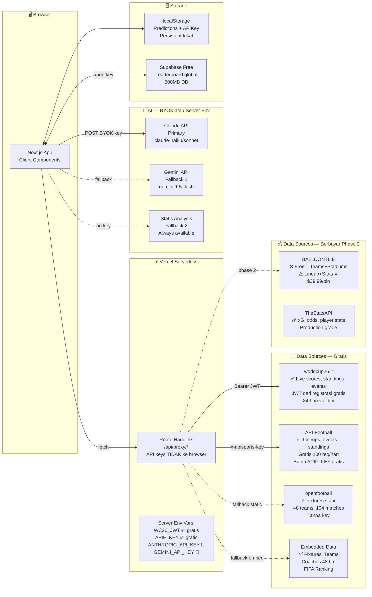

### Environment Variables (v4.0 — Lengkap)

| Variable | Scope | Wajib? | Cara Setup |
|----------|-------|:------:|-----------|
| `WC26_JWT` | Server-only | ✅ Utama | Daftar gratis di worldcup26.ir |
| `APIF_KEY` | Server-only | ✅ Utama | Daftar gratis di api-football.com |
| `ANTHROPIC_API_KEY` | Server-only | ⚠️ Opsional | console.anthropic.com atau BYOK via Settings |
| `GEMINI_API_KEY` | Server-only | ⚠️ Opsional | aistudio.google.com atau BYOK via Settings |
| `NEXT_PUBLIC_SUPABASE_URL` | Public | ⚠️ Opsional | supabase.com → Settings → API |
| `NEXT_PUBLIC_SUPABASE_ANON_KEY` | Public | ⚠️ Opsional | supabase.com → Settings → API |
| `BALLDONTLIE_KEY` | Server-only | ❌ Phase 2 | app.balldontlie.io — tier GOAT $39.99/bln |

---

## 🧩 CONFIDENCE TIER SYSTEM (v4.0 — Bobot Direvisi)

Perbaikan dari ARCH-FINDING-04: bobot hanya untuk data yang **benar-benar tersedia**.

```typescript
function calculateSystemConfidence(data: MatchData): ConfidenceResult {
  const components = [
    // Selalu tersedia (embedded)
    { component: 'FIFA Ranking tersedia', points: 15, available: !!data.fifaRanking },
    { component: 'Profil pelatih tersedia', points: 20, available: !!data.coach?.winRate },
    // Tersedia dari API-Football (gratis, limit)
    { component: 'Lineup Starting XI', points: 20, available: data.lineup?.starters?.length >= 11 },
    { component: 'Lineup dikonfirmasi', points: 10, available: !!data.lineup?.isConfirmed },
    // Tersedia saat LIVE
    { component: 'Live events aktif', points: 10, available: data.commentary?.length > 0 },
    // Tersedia jika APIF punya historis
    { component: 'Head to Head data', points: 10, available: !!data.headToHead },
    // Bonus jika tactical engine berjalan
    { component: 'Tactical matchup computed', points: 15, available: !!data.tacticalMatchup },
  ];
  // Score 0-100. Tanpa data apapun = 0. Semua tersedia = 100.
  const score = components.reduce((sum, c) => sum + (c.available ? c.points : 0), 0);
  const tier = score >= 75 ? 'TIER4' : score >= 50 ? 'TIER3' : score >= 25 ? 'TIER2' : 'TIER1';
  return { score, tier, breakdown: components };
}
```

---

## 🧠 TACTICAL MATCHUP ENGINE SPECIFICATION (Baru)

### Formation Advantage Matrix

| Home ↓ / Away → | 4-3-3 | 4-2-3-1 | 3-5-2 | 4-4-2 | 3-4-3 |
|-----------------|:-----:|:-------:|:-----:|:-----:|:-----:|
| **4-3-3** | Balanced | Home+0.3 | Away+0.4 | Home+0.2 | Away+0.2 |
| **4-2-3-1** | Away+0.3 | Balanced | Away+0.5 | Home+0.3 | Away+0.3 |
| **3-5-2** | Home+0.4 | Home+0.5 | Balanced | Home+0.6 | Away+0.3 |
| **4-4-2** | Away+0.2 | Away+0.3 | Away+0.6 | Balanced | Away+0.4 |
| **3-4-3** | Home+0.2 | Home+0.3 | Home+0.3 | Home+0.4 | Balanced |

*Nilai positif = keuntungan bagi tim tersebut. Dihitung dari: lebar lapangan, press resistance, transisi, dan ruang yang tercipta.*

### Press Style Interaction

| Attacker Press | Defender Press | Hasil |
|---------------|---------------|-------|
| HIGH | HIGH | Laga intensitas tinggi, sedikit ruang, skor cenderung rendah |
| HIGH | LOW | Press tinggi unggul, tim bertahan di bawah tekanan |
| LOW | HIGH | Tim bertahan tertekan, gol cenderung lebih banyak |
| MID | MID | Balanced, prediksi skor lebih ditentukan ranking |

### Playing Style Clash

| Home Style | Away Style | Advantage |
|------------|------------|-----------|
| COUNTER | POSSESSION | Home +0.4 (ruang di belakang) |
| POSSESSION | COUNTER | Away +0.4 (ruang counter) |
| POSSESSION | POSSESSION | Skor rendah, possession battle |
| DIRECT | DIRECT | Fisik dominan, gol dari set piece |
| COUNTER | DIRECT | Balanced, tergantung kualitas individu |

---

## 📐 PREDICTION SCORE ENGINE FORMULA (v4.0)

```typescript
interface PredictionInput {
  homeRank: number;        // FIFA Ranking (1=terbaik, 200=terburuk)
  awayRank: number;
  tacticalDelta: number;   // dari TacticalMatchupEngine
  homeCoachWinRate: number; // 0-100
  awayCoachWinRate: number;
  lineupStrength?: number;  // 0-100 jika lineup tersedia
  h2hHomeWins?: number;     // jika tersedia
  h2hAwayWins?: number;
  h2hDraws?: number;
}

function estimateGoals(input: PredictionInput): { home: number; away: number } {
  const BASE_GOALS = 1.2; // rata-rata gol per tim di WC

  // Faktor 1: Ranking gap (normalized -1 to +1)
  const rankFactor = Math.tanh((input.awayRank - input.homeRank) / 40) * 0.4;

  // Faktor 2: Tactical advantage
  const tactFactor = input.tacticalDelta * 0.3;

  // Faktor 3: Coach quality
  const coachDiff = (input.homeCoachWinRate - input.awayCoachWinRate) / 100;
  const coachFactor = coachDiff * 0.2;

  // Faktor 4: Lineup (opsional, default 0)
  const lineupFactor = input.lineupStrength ? (input.lineupStrength - 50) / 100 * 0.1 : 0;

  // Faktor 5: H2H (opsional)
  const h2hFactor = input.h2hHomeWins && input.h2hAwayWins
    ? ((input.h2hHomeWins - input.h2hAwayWins) / (input.h2hHomeWins + input.h2hAwayWins + input.h2hDraws!)) * 0.1
    : 0;

  const homeExpected = BASE_GOALS + rankFactor + tactFactor + coachFactor + lineupFactor + h2hFactor;
  const awayExpected = BASE_GOALS - rankFactor - tactFactor - coachFactor - lineupFactor - h2hFactor;

  return {
    home: Math.max(0, Math.round(homeExpected * 10) / 10),
    away: Math.max(0, Math.round(awayExpected * 10) / 10),
  };
}

function scoreToPrediction(est: { home: number; away: number }) {
  return {
    homeScore: Math.round(est.home),
    awayScore: Math.round(est.away),
    alternative: {
      homeScore: Math.round(est.home) + (est.home > est.away ? 0 : 1),
      awayScore: Math.round(est.away) + (est.away > est.home ? 0 : 1),
    },
  };
}
```

---

## 📊 MATCH STATE MACHINE (v4.0 — Diperkuat)

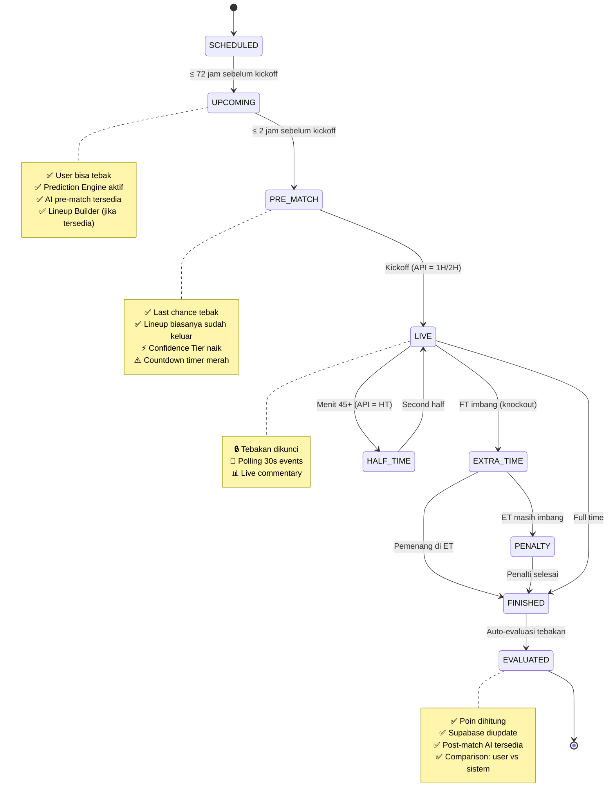

---

## 📋 REQUIREMENTS TRACEABILITY MATRIX (v4.0)

| FR | Deskripsi | Status | Tier | Data Source | Komponen |
|----|-----------|:------:|:----:|-------------|----------|
| FR-01 | Jadwal 104 match, navigasi Grup A-L + Knockout | ✅ Done | CORE | openfootball embed | FixturesPage |
| FR-02 | Live score + status match | ✅ Infrastructure | CORE | worldcup26.ir JWT | useFixtures + StatusBadge |
| FR-03 | Standings 12 grup dihitung dari hasil | ✅ Done | CORE | Computed dari fixtures | StandingsPage |
| FR-04 | Statistik tim untuk AI (FIFA ranking) | ⚠️ Partial | CORE | FIFA Ranking embedded | PredictionScoreEngine |
| FR-05 | Profil pemain lengkap | ❌ Phase 2 | PHASE-2 | API berbayar | PlayerCard (belum) |
| FR-06 | Input tebakan skor user | ✅ Done | CORE | localStorage | PredictionForm |
| FR-07 | AI analysis narasi taktis | ✅ Done | CORE | Claude/Gemini/Static | AIAnalysisPanel |
| FR-08 | Evaluasi poin setelah match | ✅ Done | CORE | localStorage + Supabase | ScoreEvaluation |
| FR-09 | Leaderboard global | ✅ Infrastructure | CORE | Supabase | LeaderboardPage |
| FR-10 | Lineup Starting XI visual | ✅ Component | CORE | API-Football (APIF_KEY) | FormationPitch |
| FR-11 | Formasi taktis SVG | ✅ Component | CORE | Coach data embed | FormationPitch |
| FR-12 | Profil pelatih 48 tim | ✅ Done | CORE | Manual embed | CoachesPage |
| FR-13 | Bandingkan dua pelatih | ✅ Done | CORE | Manual embed | CoachComparison |
| FR-14 | Confidence Level Meter | ✅ Done | CORE | Computed | ConfidenceMeter |
| FR-15 | Live event polling | ✅ Infrastructure | CORE | worldcup26.ir/API-Football | useMatchEvents |
| FR-16 | AI komentar per event | ⚠️ Partial | CORE | Perlu trigger per event | CommentaryFeed |
| FR-17 | Win probability update | ❌ Diganti | PHASE-2 | xG — berbayar | — |
| FR-18 | AI prompt multi-tier | ✅ Done | CORE | In-app | AI Route Handler |
| FR-19 | Fallback data statis | ✅ Done | CORE | openfootball + embed | api-clients |
| FR-20 | Chart perbandingan radar | ✅ Done | CORE | Embedded stats | StatRadarChart |
| FR-21 | Onboarding API key wizard | ✅ Done | CORE | localStorage | OnboardingWizard |
| FR-22 | Export/import tebakan JSON | ✅ Done | CORE | localStorage | Settings |
| FR-23 | Post-match AI analysis | ✅ Done | CORE | Claude/Gemini/Static | PostMatchPanel |
| FR-24 | Match State Machine | ✅ Done | CORE | Computed + API status | useMatchState |
| **FR-25** | **Prediction Score Engine deterministik** | ✅ Done | **CORE** | **Multi-faktor (Poisson, 5 faktor)** | **prediction-engine.ts** |
| **FR-26** | **Tactical Matchup Engine** | ✅ Done | **CORE** | **Coach embed + matrix 8x8** | **prediction-engine.ts** |
| **FR-27** | **Lineup Builder interaktif** | 🔧 Dibangun | **CORE** | **Lineup + PSE** | **LineupBuilder** |
| **FR-28** | **FIFA Ranking sebagai data input** | ✅ Done | **CORE** | **Embedded 48 tim + APIF** | **fifa-ranking.ts** |
| **FR-29** | **Second opinion prediksi (API-Football /predictions)** | ✅ Done | **CORE** | **APIF Tier 2 (gratis)** | **SecondOpinionPanel** |

---

## ❌ ERROR STATE SPECIFICATION (v4.0)

| Komponen | Error Condition | UI State | Action |
|----------|----------------|----------|--------|
| **FixtureList** | API gagal semua | Load embedded WC2026_FIXTURES | Automatic, badge "Mode Offline" |
| **PredictionScoreEngine** | FIFA Ranking tidak ada | Hitung dengan ranking 50/50 | Confidence turun ke Tier 1 |
| **TacticalMatchupEngine** | Coach data tidak ada | Skip taktis, gunakan ranking saja | Confidence turun |
| **LineupBuilder** | Lineup tidak tersedia | Placeholder + "Tersedia H-1 kickoff" | Tombol "Coba lagi" |
| **AIAnalysisPanel** | Semua AI gagal | StaticAnalysis + badge "Tanpa AI" | Tombol "Coba lagi manual" |
| **CommentaryFeed** | Polling gagal 3× | Banner + backoff 30s→60s→120s | Tombol refresh |
| **LeaderboardTable** | Supabase timeout | Cache lokal + badge "Offline" | Retry otomatis 5 menit |
| **ScoreEvaluation** | Match belum selesai | Hidden | Otomatis muncul saat FINISHED |
| **useFixtures hook** | Response tidak valid | Fallback ke WC2026_FIXTURES embed | Transparent ke user |

---

## 🏗️ TECH STACK (v4.0 — Tidak Berubah)

| Layer | Tech | Versi | Alasan |
|-------|------|-------|--------|
| Framework | Next.js | 14.x | App Router, Route Handler proxy |
| Language | TypeScript | 5.x | Type safety seluruh sistem |
| Styling | Tailwind CSS | 3.x | Design token konsisten |
| Server State | TanStack Query | 5.x | Cache + polling + stale management |
| Client State | Zustand | 4.x | Lightweight, persist |
| Charts | Recharts | 2.x | Radar chart statistik |
| Database | Supabase | - | Leaderboard global free tier |
| Deploy | Vercel | - | Edge function + CDN |
| CI/CD | GitHub Actions | - | Typecheck + build |

---

## 📅 IMPLEMENTATION ROADMAP (v4.0)

### Phase 1 — Core Foundation (SEKARANG — Turnamen berlangsung)
- [x] Fixtures page: Grup A-L tabs + Knockout *(fix bug useFixtures double-wrap)*
- [x] 48 Coach profiles dengan data akurat (Ancelotti untuk Brazil)
- [x] Evaluation sistem poin + Supabase write-back
- [x] Export/Import JSON + Web Share
- [x] Onboarding Wizard + countdown kickoff
- [x] **FR-25: Prediction Score Engine** — 5-faktor deterministik (Poisson model, `prediction-engine.ts`)
- [x] **FR-26: Tactical Matchup Engine** — formasi matrix 8x8 + press style + playing style clash
- [x] **FR-28: FIFA Ranking embed** — 48 tim (`fifa-ranking.ts`)
- [x] H2H historis 48 tim dari dataset Mart Jürisoo (`h2h-data.ts`)
- [x] Key players 5-8 pemain × 48 tim (`key-players.ts`)
- [x] **FR-29: Second opinion API-Football `/predictions`** — `SecondOpinionPanel` di tab AI & Prediksi

### Phase 2 — Tactical Depth (Minggu 1-2 Turnamen)
- [ ] **FR-27: Lineup Builder interaktif** — ganti posisi + delta score
- [ ] Tactical Matchup Visualization — SVG panah pergerakan
- [ ] Lineup dari API-Football (saat APIF_KEY dikonfigurasi)
- [ ] Live commentary AI per event
- [ ] Tier 2 lanjutan: `/players/squads` (full roster), `/teams/statistics`, `/fixtures/headtohead`, `/coachs` verifikasi
  *(client functions sudah tersedia di `api-clients.ts` — `apifSquads`, `apifTeamStatistics`, `apifHeadToHead`, `apifCoachs`; route handler & UI belum)*

### Phase 3 — Enhancement (Minggu 3-4 Turnamen)
- [ ] AI Cache di localStorage (hindari repeat call berbayar)
- [ ] Leaderboard weekly filter
- [ ] Dark mode toggle
- [ ] /coaches/[id] halaman detail pelatih
- [ ] Player top scorer manual (update harian)

### Phase 4 — Post Tournament (Setelah 19 Juli 2026)
- [ ] Full player profiles (jika ada budget API)
- [ ] Retrospective: akurasi prediksi sistem vs kenyataan
- [ ] SA v5.0 berdasarkan data aktual turnamen

---

## 🔑 SUCCESS METRICS (v4.0 — Direvisi untuk Personal Project)

| Metrik | Target | Cara Ukur |
|--------|--------|-----------|
| Semua 104 fixture tampil dengan nama tim | ✅ | Visual test |
| Prediction Score Engine akurasi > 40% correct outcome | > 40% | Evaluasi akhir turnamen |
| AI analysis jalan tanpa API key | ✅ | Static analysis fallback |
| Semua 48 pelatih menampilkan data akurat | ✅ | Manual spot check |
| Jadwal load < 1 detik (embedded) | < 1s | Browser dev tools |
| Tebakan tersimpan dan terevaluasi dengan benar | ✅ | Manual test |
| Lineup Builder mengubah prediksi skor | ✅ | Delta !== 0 |

---

## 📌 CATATAN PENTING UNTUK IMPLEMENTASI

### Bug Fix Wajib Sebelum Lanjut

```typescript
// BUG YANG SUDAH DIPERBAIKI (BUG-FIX-01):
// useFixtures hook double-wrapping response

// SEBELUM (salah):
const { data, source } = await getJSON<RealFixture[]>("/api/proxy/fixtures");
// "data" = { source: "wc2026-embedded", data: [...] } ← OBJECT, bukan array!
const list = Array.isArray(data) ? data : WC2026_FIXTURES; // selalu WC2026_FIXTURES

// SESUDAH (benar):
try {
  const res = await fetchProxy<RealFixture[]>("/api/proxy/fixtures");
  const list = Array.isArray(res.data) && res.data.length > 50
    ? res.data
    : WC2026_FIXTURES;
} catch {
  return { fixtures: WC2026_FIXTURES, source: "wc2026-embedded" };
}
```

### Canonical Data Format Rules

```typescript
// 1. group field: SELALU "Group A" - "Group L" (bukan "A")
// 2. team id: SELALU lowercase fifa code (mex, bra, eng)
// 3. status: SELALU dari enum MatchState
// 4. kickoff: SELALU UTC ISO string "2026-06-11T19:00:00Z"
// 5. FIFA Ranking: integer 1-200 (1 = terbaik)
```

---

*SA v4.0 selesai — 10 Juni 2026*
*Catatan: Dokumen ini merupakan living document. Update setelah setiap phase implementation.*
*Review berikutnya: Setelah Phase 1 selesai (estimasi 3-5 hari ke depan).*
